1. Introduction
1.1 Mục đích
Mô tả mục đích của tài liệu SRS
Tài liệu Đặc tả yêu cầu phần mềm (SRS) này được lập ra nhằm mô tả chi tiết và toàn diện các yêu cầu chức năng, yêu cầu phi chức năng, cũng như các ràng buộc của "Hệ thống phần mềm quản lý học sinh GtuSchool”. Tài liệu đóng vai trò là cơ sở thống nhất sự hiểu biết giữa đội ngũ phát triển (Nhóm 3), các bên liên quan và người dùng cuối (Phụ huynh, giáo viên, học sinh) để tiến hành các giai đoạn thiết kế và lập trình tiếp theo.
1.2 Phạm vi
●      Hệ thống Quản lý Học sinh THPT là một ứng dụng web cho phép:
·       Quản lý tài khoản và phân quyền
·       Quản lý hồ sơ học sinh
·       Quản lý lớp học
·       Quản lý điểm số và học lực
·       Quản lý hạnh kiểm
·       Thống kê – báo cáo
·       Hệ thống và bảo trì
·       Hệ thống phục vụ cho Ban giám hiệu, giáo viên và nhân viên văn phòng.
1.3 Định nghĩa, viết tắt, thuật ngữ viết tắt
Để đảm bảo tính nhất quán khi đọc tài liệu, các thuật ngữ và từ viết tắt dưới đây được thống nhất sử dụng:
●       SRS (Software Requirements Specification): Tài liệu đặc tả yêu cầu phần mềm.
●       Combo: Gói kết hợp nhiều linh kiện với nhau để được hưởng chính sách giá ưu đãi.
●       FR (Functional Requirement): Yêu cầu chức năng (Hệ thống phải làm được gì).
●       NFR (Non-Functional Requirement): Yêu cầu phi chức năng (Hệ thống hoạt động tốt ra sao: bảo mật, tốc độ...).
●       Actor (Tác nhân): Người dùng hoặc hệ thống bên ngoài có tương tác trực tiếp với phần mềm.
1.4 Tài liệu tham khảo
ISO/IEC/IEEE 29148:2018
Tài liệu nghiệp vụ
Use Case, UML
1.5 Tổng quát
Phần còn lại của tài liệu SRS này được tổ chức như sau:
●       Phần II - Yêu cầu chức năng (FR): Liệt kê chi tiết các chức năng mà hệ thống phải cung cấp, được chia theo từng phân hệ 
●       Phần III - Yêu cầu phi chức năng (NFR): Xác định các tiêu chuẩn về hiệu năng, bảo mật, an toàn dữ liệu và khả năng sử dụng mà hệ thống phải đáp ứng.
2. Mô tả tổng quan
2.1 Bối cảnh sản phẩm
●       Hiện trạng: Hiện tại, nhà trường đang vận hành phần lớn dựa trên các công cụ thủ công (sổ sách, Excel, hóa đơn giấy). Điều này gây ra nhiều rủi ro về thất thoát dữ liệu, mất nhiều thời gian nhập liệu, và tốn chi phí cho quản lý lưu trữ tài liệu.
Bối cảnh hệ thống mới: 
Tương tác phần cứng:  Hệ thống được thiết kế để tương thích và nhận dữ liệu trực tiếp từ các thiết bị ngoại vi như: máy in, máy scan tài liệu
2.2 Chức năng sản phẩm 
Các chức năng chính của hệ thống bao gồm:
Quản lý tài khoản và phân quyền
Đăng nhập hệ thống
Tạo, chỉnh sửa, khóa/xóa tài khoản
Phân quyền theo vai trò (Admin, Giáo viên, Nhân viên, BGH)
Quản lý hồ sơ học sinh
Thêm mới học sinh
Cập nhật thông tin học sinh
Tìm kiếm học sinh
Quản lý lớp học
Tạo và quản lý lớp học
Phân công giáo viên chủ nhiệm
Quản lý điểm số và học lực
Nhập và chỉnh sửa điểm
Tự động tính điểm trung bình
Xếp loại học lực
Quản lý hạnh kiểm
Nhập và cập nhật hạnh kiểm học sinh
Thống kê – báo cáo
In bảng điểm
Xuất học bạ (PDF)
Thống kê học lực
Hệ thống và bảo trì
Sao lưu và phục hồi dữ liệu
Lưu lịch sử thay đổi
2.3 User Classes and Characteristics
Các nhóm người dùng chính của hệ thống bao gồm:
Quản trị viên (Admin):
Có toàn quyền quản lý hệ thống
Quản lý tài khoản và phân quyền
Yêu cầu: hiểu biết tốt về hệ thống
Giáo viên:
Nhập điểm, quản lý lớp phụ trách
Theo dõi kết quả học tập học sinh
Yêu cầu: kỹ năng tin học cơ bản
Nhân viên văn phòng:
Quản lý hồ sơ học sinh
Nhập và cập nhật thông tin
Yêu cầu: sử dụng thành thạo máy tính
Ban giám hiệu:
Xem báo cáo tổng hợp
Theo dõi tình hình học tập
Yêu cầu: thao tác cơ bản, dễ sử dụng 
2.4 Operating Environment
Hệ thống hoạt động trong môi trường:
Client (Người dùng):
Trình duyệt: Chrome, Edge, Firefox
Thiết bị: PC, Laptop, Smartphone
Hệ điều hành: Windows, Android, iOS
Server:
Hệ điều hành: Linux (Ubuntu/CentOS) hoặc Windows Server
Web Server: Apache / Nginx
Database:
MySQL hoặc SQL Server
Mạng:
Mạng nội bộ hoặc Internet
Kết nối ổn định
2.5 Design and Implementation Constraints
Các ràng buộc dưới đây được xác định dựa trên yêu cầu chức năng và phi chức năng của hệ thống:
Kiến trúc hệ thống
Hệ thống phải được tổ chức thành các tầng tách biệt rõ ràng giữa giao diện người dùng, xử lý nghiệp vụ và lưu trữ dữ liệu, nhằm đảm bảo khả năng bảo trì và mở rộng (NFR-20, NFR-26). Các thành phần nghiệp vụ phải được phân tách theo nhóm chức năng (quản lý tài khoản, học sinh, điểm số, hạnh kiểm, báo cáo, hệ thống) để dễ kiểm thử độc lập và truy vết yêu cầu.
Bảo mật và phân quyền
Hệ thống phải kiểm soát truy cập theo vai trò người dùng, đảm bảo mỗi actor chỉ thao tác được đúng phạm vi chức năng được giao (NFR-09). Mật khẩu người dùng phải được lưu trữ ở dạng đã băm một chiều với độ bền cao (NFR-10). Phiên làm việc phải có cơ chế hết hạn tự động sau thời gian không hoạt động (NFR-11). Hệ thống phải khóa tài khoản tạm thời khi phát hiện đăng nhập sai nhiều lần liên tiếp (NFR-13). Toàn bộ dữ liệu truyền giữa client và server phải được mã hóa trong môi trường production (NFR-12).
Giao tiếp giữa các thành phần
Giao tiếp giữa frontend và backend phải thông qua một tầng API nhất quán, sử dụng định dạng dữ liệu chuẩn, dễ kiểm thử tự động và có thể mở rộng tích hợp hệ thống khác trong tương lai (NFR-26, NFR-27). Cơ chế xác thực phải được áp dụng thống nhất cho toàn bộ API.
Hiệu năng và khả năng chịu tải
Thiết kế hệ thống phải đáp ứng tối thiểu 100 người dùng truy cập đồng thời mà không làm suy giảm đáng kể thời gian phản hồi (NFR-02). Các truy vấn liên quan đến tính toán điểm và xuất báo cáo phải được thiết kế để hoàn thành trong thời gian chấp nhận được (NFR-01, NFR-03).
Tính nhất quán và toàn vẹn dữ liệu
Hệ thống phải đảm bảo tính chính xác tuyệt đối trong tính toán điểm và xếp loại học lực theo quy chế của Bộ GD&ĐT (NFR-05, NFR-32). Mọi thao tác thay đổi dữ liệu quan trọng phải được ghi lại đầy đủ để phục vụ truy vết và kiểm soát (NFR-06, FR-55).
Sao lưu và phục hồi
Hệ thống phải có cơ chế sao lưu dữ liệu định kỳ tự động và hỗ trợ phục hồi trong thời gian quy định khi xảy ra sự cố (NFR-28, NFR-29). Dữ liệu sao lưu phải được lưu tách biệt khỏi máy chủ chính (NFR-30).
Khả năng triển khai và cấu hình
Hệ thống phải có thể triển khai trên nhiều hệ điều hành máy chủ phổ biến mà không cần chỉnh sửa mã nguồn (NFR-24). Các tham số cấu hình như kết nối cơ sở dữ liệu và cài đặt email phải được tách biệt khỏi mã nguồn và dễ thay đổi theo môi trường (NFR-25).
Quản lý mã nguồn và bảo trì
Mã nguồn phải được quản lý phiên bản tập trung để hỗ trợ làm việc nhóm và theo dõi lịch sử thay đổi (NFR-22). Cấu trúc mã phải rõ ràng, có tài liệu nội bộ đầy đủ để đảm bảo khả năng bảo trì lâu dài (NFR-20, NFR-21).
Tuân thủ pháp lý
Hệ thống phải tuân thủ các quy định hiện hành về bảo vệ dữ liệu cá nhân tại Việt Nam (NFR-31).
2.6 User Documentation
Tài liệu hướng dẫn người dùng bao gồm:
Hướng dẫn đăng nhập và sử dụng hệ thống
Hướng dẫn nhập điểm và quản lý học sinh
Tài liệu FAQ (câu hỏi thường gặp)
Tài liệu được cung cấp dưới dạng:
File PDF
Hướng dẫn trực tiếp trên hệ thống
2.7 Assumptions and Dependencies
Assumptions (Giả định):
Người dùng có kỹ năng sử dụng máy tính cơ bản
Nhà trường có hệ thống mạng ổn định
Dữ liệu được nhập chính xác
Quy định tính điểm là thống nhất
Dependencies (Phụ thuộc):
Phụ thuộc vào:
Hệ thống mạng
Máy chủ của nhà trường
Framework (React, Spring Boot, Node.js)
Phụ thuộc vào dịch vụ:
SMTP (gửi email)
Có thể tích hợp:
LDAP/SAML trong tương lai
3. System Features (Functional Requirements)
3.1 FR-01: Đăng nhập hệ thống
Description: Hệ thống cho phép người dùng đăng nhập bằng email/tên đăng nhập và mật khẩu đã được cấp để truy cập vào hệ thống theo vai trò tương ứng.
Input
○ Email hoặc tên đăng nhập
○ Mật khẩu
Processing
○ Kiểm tra dữ liệu nhập không được rỗng
○ Xác thực thông tin với cơ sở dữ liệu
○ Kiểm tra trạng thái tài khoản (bị khóa hay không)
○ Kiểm tra số lần đăng nhập sai (theo NFR-13)
○ Xác định vai trò người dùng
Output
○ Đăng nhập thành công → chuyển đến giao diện theo vai trò
○ Hiển thị thông báo lỗi nếu đăng nhập thất bại
Exception
Sai tài khoản hoặc mật khẩu
Tài khoản bị khóa
Vượt quá số lần đăng nhập cho phép
Lỗi hệ thống hoặc kết nối
Priority: High (Rất quan trọng – chức năng cốt lõi)
3.2 FR-02: Thêm người dùng
Description: Hệ thống cho phép quản trị viên tạo tài khoản người dùng mới với đầy đủ thông tin cần thiết: họ tên, email, vai trò, trạng thái
Input
○ Họ tên
○ Email
○ Vai trò
○ Trạng thái tài khoản
Processing
○ Kiểm tra dữ liệu đầu vào hợp lệ
○ Kiểm tra email không trùng
○ Gán vai trò người dùng
○ Tạo mật khẩu mặc định (hoặc sinh tự động)
○ Lưu vào cơ sở dữ liệu
Output
○ Thông báo tạo tài khoản thành công
○ Hiển thị thông tin người dùng vừa tạo
Exception
○ Email đã tồn tại
○ Thiếu thông tin bắt buộc
○ Lỗi lưu dữ liệu
Priority: High
 
3.3 FR-03: Cập nhật thông tin người dùng
Description: Hệ thống cho phép quản trị viên cập nhật thông tin tài khoản người dùng.
Input
○ Thông tin cần cập nhật (họ tên, email, vai trò, trạng thái)
Processing
○ Kiểm tra dữ liệu hợp lệ
○ Kiểm tra quyền thực hiện (chỉ Admin)
○ Cập nhật thông tin vào hệ thống
○ Ghi log thay đổi (FR-55)
Output
○ Thông báo cập nhật thành công
○ Hiển thị thông tin mới
Exception
○ Không có quyền truy cập
○ Email trùng
○ Lỗi cập nhật dữ liệu
Priority
High
 
3.4 FR-04: Khóa/Mở khóa tài khoản
Description: Hệ thống cho phép quản trị viên khóa hoặc mở khóa tài khoản người dùng.
Input
○ ID tài khoản
○ Trạng thái (khóa/mở khóa)
Processing
○ Kiểm tra quyền admin
○ Cập nhật trạng thái tài khoản
○ Ghi lịch sử thay đổi
Output
○ Thông báo thao tác thành công
Exception
○ Không có quyền
○ Tài khoản không tồn tại
Priority: High
 
3.5 FR-05: Xóa tài khoản người dùng
Description: Hệ thống cho phép quản trị viên xóa tài khoản người dùng khỏi hệ thống.
Input
○ ID tài khoản cần xóa
Processing
○ Kiểm tra quyền admin
○ Kiểm tra ràng buộc dữ liệu (liên quan lớp, điểm,...)
○ Xác nhận xóa
○ Xóa dữ liệu hoặc đánh dấu xóa
Output
○ Thông báo xóa thành công
Exception
○ Không có quyền
○ Không thể xóa do ràng buộc dữ liệu
○ Lỗi hệ thống
Priority: High
 
 
 
3.6 FR-06: Phân quyền người dùng
Description: Hệ thống cho phép quản trị viên phân quyền truy cập cho người dùng theo các vai trò khác nhau.
Input
○ ID người dùng
○ Vai trò (Admin, Giáo viên, Nhân viên, BGH, Học sinh)
Processing
○ Kiểm tra quyền của người thực hiện (phải là Admin)
○ Kiểm tra vai trò hợp lệ
○ Cập nhật vai trò vào hệ thống
○ Ghi log thay đổi
Output
○ Thông báo phân quyền thành công
Exception
○ Không có quyền truy cập
○ Vai trò không hợp lệ
○ Người dùng không tồn tại
Priority: High
 
3.7 FR-07: Điều hướng theo vai trò
Description: Hệ thống tự động chuyển hướng người dùng đến giao diện tương ứng sau khi đăng nhập thành công.
Input
○ Thông tin người dùng (vai trò)
Processing
○ Xác định vai trò
○ Tải giao diện phù hợp
Output
○ Giao diện hệ thống theo vai trò
Exception
○ Vai trò không xác định
Priority: High
 
3.8 FR-08: Yêu cầu đặt lại mật khẩu
Description: Hệ thống cho phép người dùng yêu cầu đặt lại mật khẩu thông qua email đã đăng ký.
Input
○ Email
Processing
○ Kiểm tra email tồn tại
○ Tạo link đặt lại mật khẩu
○ Gửi email
Output
○ Thông báo gửi email thành công
Exception
○ Email không tồn tại
○ Lỗi gửi email
Priority: High
 
3.9 FR-09: Đặt lại mật khẩu bởi Admin
Description: Hệ thống cho phép quản trị viên đặt lại mật khẩu cho người dùng.
Input
○ ID người dùng
Processing
○ Kiểm tra quyền Admin
○ Sinh mật khẩu mới
○ Cập nhật hệ thống
○ Ghi log
Output
○ Thông báo thành công
Exception
○ Không có quyền
○ Người dùng không tồn tại
Priority: High
 
3.10 FR-10: Thêm hồ sơ học sinh
Description: Hệ thống cho phép thêm mới hồ sơ học sinh với đầy đủ thông tin cá nhân.
Input
○ Họ tên, ngày sinh, giới tính, địa chỉ, dân tộc, tôn giáo
○ Thông tin phụ huynh
Processing
○ Kiểm tra dữ liệu đầu vào
○ Tạo mã học sinh
○ Lưu vào hệ thống
Output
○ Thêm hồ sơ thành công
Exception
○ Thiếu thông tin
○ Dữ liệu không hợp lệ
Priority: High
 
3.11 FR-11: Tạo mã học sinh
Description: Hệ thống tự động tạo mã học sinh duy nhất.
Input
○ Không có
Processing
○ Sinh mã theo quy tắc HS + số thứ tự
○ Kiểm tra trùng
Output
○ Mã học sinh
Exception
○ Lỗi sinh mã
Priority: Medium
 
3.12 FR-12: Cập nhật hồ sơ học sinh
Description: Hệ thống cho phép cập nhật thông tin học sinh.
 
Input
○ Thông tin cần cập nhật
Processing
○ Kiểm tra hợp lệ
○ Cập nhật hệ thống
○ Ghi log
Output
○ Cập nhật thành công
Exception
○ Học sinh không tồn tại
Priority: High
 
3.13 FR-13: Tìm kiếm học sinh
Description: Hệ thống cho phép tìm kiếm học sinh theo nhiều tiêu chí.
Input
○ Mã HS / Tên / Lớp
Processing
○ Truy vấn dữ liệu
Output
○ Danh sách kết quả
Exception
○ Không tìm thấy
Priority: High
 
3.14 FR-14: Hiển thị phân trang
Description: Hiển thị danh sách học sinh theo từng trang.
Input
○ Số trang
Processing
○ Phân trang (20 bản ghi/trang)
Output
○ Danh sách học sinh
Exception
○ Trang không hợp lệ
Priority: Medium
3.15 FR-15: Lọc danh sách học sinh
Description:Hệ thống cho phép lọc danh sách học sinh theo các tiêu chí như họ tên, ngày sinh, giới tính, địa chỉ, dân tộc, tôn giáo, họ tên cha, mẹ, số điện thoại, lớp 
Input: 
○ Họ tên (tùy chọn)
○ Ngày sinh (tùy chọn)
○ Giới tính (tùy chọn)
○ Địa chỉ (tùy chọn)
○ Dân tộc (tùy chọn)
○ Tôn giáo (tùy chọn)
○ Họ tên cha (tùy chọn)
○ Họ tên mẹ (tùy chọn)
○ Số điện thoại (tùy chọn)
○ Lớp (tùy chọn)
Processing:
○ Nhận các tiêu chí lọc từ người dùng
○ Kiểm tra tính hợp lệ của dữ liệu đầu vào
○ Thực hiện truy vấn dữ liệu theo các điều kiện đã nhập (có thể kết hợp nhiều điều kiện)
Exception:
○ Không có dữ liệu phù hợp
○ Giá trị trạng thái không hợp lệ
○ Dữ liệu đầu vào sai định dạng
Priority: Medium

3.16 FR-16: Tạo lớp học
Description: Cho phép tạo lớp học mới.
Input
○ Tên lớp, khối, năm học, sĩ số, trạng thái
Processing
○ Kiểm tra trùng
○ Lưu dữ liệu
Output
○ Thành công
Exception
○ Trùng lớp
Priority: High
 
3.17 FR-17: Cập nhật lớp
Description: Cho phép cập nhật thông tin lớp.
Input
○ Thông tin lớp
Processing
○ Cập nhật dữ liệu
Output
○ Thành công
Exception
○ Không tồn tại
Priority: High
 
3.18 FR-18: Xóa lớp
Description: Xóa lớp khi không có học sinh.
Input
○ ID lớp
Processing
○ Kiểm tra ràng buộc
○ Xóa
Output
○ Thành công
Exception
○ Lớp còn học sinh
Priority: High
 
3.19 FR-19: Phân công giáo viên chủ nhiệm
Description: Phân công giáo viên chủ nhiệm cho từng lớp.
Input
○ Lớp, giáo viên
Processing
○ Gán dữ liệu
Output
○ Thành công
Exception
○ Trùng phân công
Priority: High
 
3.20 FR-20: Kiểm tra trùng giáo viên
Description: Không cho giáo viên chủ nhiệm nhiều lớp cùng năm.
Input
○ Giáo viên
Processing
○ Kiểm tra dữ liệu
Output
○ Kết quả hợp lệ
Exception
○ Vi phạm quy tắc
Priority: High

3.21 FR-21: Lọc lớp học
Description: Hệ thống cho phép lọc danh sách lớp học theo các tiêu chí như tên lớp, khối, năm học, giáo viên chủ nhiệm và sĩ số.
Input:
○ Tên lớp (tùy chọn)
○ Khối (tùy chọn)
○ Năm học (tùy chọn)
○ Giáo viên chủ nhiệm (tùy chọn – chọn từ danh sách giáo viên có sẵn trong hệ thống, không nhập tự do)
○ Sĩ số (tùy chọn –)
Processing:
○ Nhận các tiêu chí lọc từ người dùng
 ○ Kiểm tra dữ liệu đầu vào:
Giáo viên chủ nhiệm phải thuộc danh sách giáo viên hiện có trong hệ thống
Năm học đúng định dạng (ví dụ: YYYY–YYYY)
Sĩ số là số nguyên không âm
 ○ Thực hiện truy vấn và lọc dữ liệu theo một hoặc nhiều điều kiện kết hợp
Output:
○ Danh sách lớp học thỏa mãn điều kiện lọc
Exception:
○ Không có dữ liệu phù hợp
○ Dữ liệu đầu vào không hợp lệ (ví dụ: sĩ số âm, năm học sai định dạng)
Priority: Medium
3.22 FR-22: Nhập điểm học sinh
Description: Hệ thống cho phép giáo viên nhập điểm cho học sinh theo từng môn học và học kỳ.
Input
○ Mã học sinh
○ Môn học
○ Học kỳ
○ Các loại điểm (miệng, 15 phút, 1 tiết, học kỳ)
Processing
○ Kiểm tra quyền giáo viên
○ Kiểm tra dữ liệu nhập
○ Lưu điểm vào hệ thống
Output
○ Thông báo nhập điểm thành công
Exception
○ Không có quyền
○ Dữ liệu không hợp lệ
Priority: High
 
3.23 FR-23: Kiểm tra điểm hợp lệ
Description: Hệ thống kiểm tra điểm phải nằm trong khoảng hợp lệ.
Input
○ Giá trị điểm
Processing
○ Kiểm tra điểm từ 0 đến 10
○ Kiểm tra kiểu số
Output
○ Xác nhận hợp lệ
Exception
○ Điểm ngoài khoảng
○ Không phải số
Priority: High
 
3.24 FR-24: Chỉnh sửa điểm
Description: Giáo viên có thể chỉnh sửa điểm đã nhập.
Input
○ Điểm mới
Processing
○ Kiểm tra quyền
○ Cập nhật dữ liệu
○ Ghi log
Output
○ Cập nhật thành công
Exception
○ Không có quyền
○ Không tồn tại dữ liệu
Priority: High
 
3.25 FR-25: Tính điểm trung bình môn
Description: Hệ thống tự động tính điểm trung bình môn học kỳ.
Input
○ Các loại điểm
Processing
○ Áp dụng công thức tính: (Điểm miệng + Điểm 15 phút × 2 + Điểm 1 tiết × 3 + Điểm học kỳ × 4) / Tổng hệ số.
Output
○ Điểm trung bình môn
Exception
○ Thiếu dữ liệu điểm
Priority: Medium
 
3.26 FR-26: Tính điểm trung bình học kỳ
Description: Hệ thống tính điểm trung bình học kỳ.
Input
○ Điểm trung bình các môn trong học kỳ
Processing
○ Tính trung bình cộng
Output
○ Điểm TB học kỳ
Exception
○ Không đủ dữ liệu
Priority: Medium
 
3.27 FR-27: Tính điểm trung bình năm
Description: Hệ thống tính điểm trung bình cả năm.
Input
○ TB HK1, TB HK2
Processing
○ Áp dụng công thức: (Điểm TB học kỳ 1 + Điểm TB học kỳ 2 × 2) / 3.
Output
○ Điểm TB năm
Exception
○ Thiếu dữ liệu
Priority: Medium
 
3.28 FR-28: Xếp loại học lực
Description: Hệ thống xếp loại học lực học sinh.
Input
○ Điểm trung bình
Processing
○ So sánh theo quy định của Bộ GD&ĐT
○ So sánh dựa theo điểm trung bình
Output
○ Loại học lực
Exception
○ Không đủ dữ liệu
Priority: High
3.29 FR-29: Nhập hạnh kiểm
Description: Hệ thống cho phép giáo viên chủ nhiệm nhập hạnh kiểm cho học sinh
Input
○ Mã HS
○ Học kỳ
○ Hạnh kiểm(Tốt, Khá, Trung bình, Yếu.)
Processing
○ Kiểm tra dữ liệu
○ Lưu
Output
○ Thành công
Exception
○ Giá trị không hợp lệ
Priority: Medium
 
3.30 FR-30: Cập nhật hạnh kiểm
Description: Hệ thống cho phép giáo viên và nhân viên văn phòng cập nhật hạnh kiểm của học sinh.
Input
○ Thông tin hạnh kiểm
Processing
○ Update
○ Ghi log
Output
○ Thành công
Exception
○ Không tồn tại
Priority: Medium
3.31 FR-31: Thêm năm học
Description: Hệ thống cho phép nhân viên văn phòng thực hiện thêm mới năm học
Input
○ Tên năm học
Processing
○ Kiểm tra trùng
○ Lưu
Output
○ Thành công
Exception
○ Trùng dữ liệu
Priority: High
 
3.32 FR-32 Cập nhật năm học
Description: Hệ thống cho phép nhân viên văn phòng thực hiện cập nhật năm học
Input
○ Thông tin
Processing
○ Update
Output
○ Thành công
Exception
○ Không tồn tại
Priority: High
3.33 FR-33: Xóa năm học
Description: Hệ thống cho phép nhân viên văn phòng thực hiện xóa năm học khi chưa có dữ liệu
Input
○ ID năm học
Processing
○ Kiểm tra ràng buộc
○ Xóa
Output
○ Thành công
Exception
○ Đã có dữ liệu
Priority: High
 
3.34 FR-34: Thiết lập năm học hiện tại
Description: Hệ thống chỉ cho phép tại 1 thời điểm chỉ tồn tại duy nhất 1 năm học hiện tại
Input
○ Năm học
Processing
○ Kiểm tra
○ Cập nhật trạng thái
Output
○ Thành công
Exception
○ Xung đột dữ liệu
Priority: High
 
3.35 FR-35: Gán giá trị năm học mặc định
Description: Hệ thống tự động thiết lập năm học hiện tại làm giá trị mặc định cho trường “năm học”
Input
○ Không
Processing
○ Lấy năm học hiện tại
○ Gán mặc định áp dụng cho tất cả các trường  “năm học” trong tất cả các nghiệp vụ: tạo lớp học, phân công giảng dạy, nhập điểm, tạo thời khóa biểu, nhập hạnh kiểm.

Output
○ Giá trị mặc định
Exception
○ Không có năm học
Priority: Medium
 
 
3.36 FR-36: Xem hồ sơ cá nhân
Description: Hệ thống cho phép học sinh xem thông tin hồ sơ cá nhân của mình 
Input
○ ID người dùng
Processing
○ Truy vấn
Output
○ Thông tin
Exception
○ Không tồn tại
Priority: Medium
 
3.37 FR-37: Xem điểm
Description: Hệ thống cho phép học sinh xem điểm số các môn học của mình theo từng học kỳ
Input
○ Học kỳ
Processing
○ Lấy dữ liệu điểm gồm: điểm miệng, điểm 15p, điểm 1 tiết, điểm học kỳ và điểm trung bình môn
Output
○ Bảng điểm
Exception
○ Không có dữ liệu
Priority: Medium
 
3.38 FR-38: Xem học lực và hạnh kiểm
Description: Hệ thống cho phép học sinh xem kết quả xếp loại học lực và hạnh kiểm theo từng học kỳ và cả năm.
Input
○ Học kỳ
Processing
○ Tổng hợp
Output
○ Kết quả
Exception
○ Không đủ dữ liệu
Priority: Medium
 
3.39 FR-39: Xuất học bạ PDF
Description: Hệ thống cho phép học sinh xem và tải học bạ của mình dưới dạng file PDF theo mẫu thống nhất .
Input
○ ID học sinh
Processing
○ Tạo file học bạ dạng PDF
Output
○ File PDF học bạ
Exception
○ Lỗi tạo file
Priority: Medium
 
 
3.40 FR-40: Tạo thời khóa biểu
Description: Hệ thống cho phép nhân viên văn phòng tạo thời khóa biểu cho từng lớp theo từng học kỳ
Input
○ Môn, GV, tiết
Processing
○ Kiểm tra dữ liệu
○ Lưu
Output
○ Cập nhật thành công
Exception
○ Trùng lịch
Priority: High
3.41 FR-41: Cập nhật thời khóa biểu
Description: Hệ thống cho phép nhân viên văn phòng cập nhật, điều chỉnh thời khóa biểu khi cần.
Input
○ Thông tin cần cập nhật của TKB 
Processing
○ Update thông tin
Output
○ Thành công
Exception
○ Không tồn tại
Priority: High
 
 
 
 
3.42 FR-42: Kiểm tra trùng lịch
Description: Hệ thống kiểm tra và ngăn chặn việc xếp lịch trùng giáo viên, trùng phòng học trong cùng một tiết.
Input
○ Lịch
Processing
○ Kiểm tra trùng: phòng học và giáo viên
Output
○ Kết quả hợp lệ
Exception
○ Trùng lịch
Priority: High
 
3.43 FR-43: Xem thời khóa biểu (Học sinh)
Description: Hệ thống cho phép học sinh xem thời khóa biểu của lớp mình.
Input
○ ID học sinh
Processing
○ Xác định lớp
○ Truy vấn thời khóa biểu
 Output
○ Thời khóa biểu
Exception
○ Không có dữ liệu
Priority: High
3.44 FR-44: Xem thời khóa biểu toàn trường (BGH)
Description: Hệ thống cho phép Ban giám hiệu xem thời khóa biểu toàn trường.
Input
○ ID người dùng
Processing
○ Kiểm tra quyền
○ Truy vấn toàn bộ dữ liệu
Output
○ Thời khóa biểu toàn trường
Exception
○ Không có quyền
Priority: High
 
 
3.45 FR-45: Thêm môn học
Description: Hệ thống cho phép nhân viên văn phòng thêm mới môn học với các thông tin: tên môn, mã môn, số tiết/tuần.
Input
○ Tên môn
○ Mã môn
○ Số tiết/tuần
Processing
○ Kiểm tra trùng
○ Lưu dữ liệu
Output
○ Thêm thành công
Exception
○ Trùng mã môn
Priority: High
 
 
 
3.46 FR-46: Cập nhật môn học
Description: Hệ thống cho phép nhân viên văn phòng cập nhật thông tin môn học.
Input
○ Thông tin môn học
Processing
○ Kiểm tra tồn tại
○ Cập nhật
Output
○ Cập nhật thành công
Exception
○ Không tồn tại
Priority: High
 
 
3.47 FR-47: Xóa môn học
Description: Hệ thống cho phép nhân viên văn phòng xóa môn học (môn học không còn trong chương trình giảng dạy).
Input
○ Mã môn
Processing
○ Kiểm tra ràng buộc
○ Xóa
Output
○ Thành công
Exception
○ Đang được sử dụng
Priority: High
 
3.48 FR-48: Phân công giảng dạy
Description: Hệ thống cho phép nhân viên văn phòng phân công giáo viên giảng dạy cho từng môn học, từng lớp, từng học kỳ
Input
○ Giáo viên
○ Môn học
○ Lớp
○ Học kỳ
Processing
○ Kiểm tra dữ liệu
○ Lưu phân công
Output
○ Thành công
Exception
○ Trùng phân công
Priority: High
 
3.49 FR-49: Xem phân công giảng dạy
Description: Hệ thống cho phép xem danh sách phân công giảng dạy theo giáo viên, theo lớp hoặc theo môn học.
Input
○ Tiêu chí lọc
Processing
○ Truy vấn dữ liệu
Output
○ Danh sách phân công
Exception
○ Không có dữ liệu
Priority: Medium
 
3.50 FR-50: Phê duyệt phân công
Description: Hệ thống cho phép Ban giám hiệu phê duyệt phân công giảng dạy
Input
○ ID phân công
Processing
○ Kiểm tra quyền
○ Cập nhật trạng thái
Output
○ Phê duyệt thành công
Exception
○ Không có quyền
Priority: High
 
 
3.51 FR-51: Giáo viên xem phân công
Description: Hệ thống cho phép giáo viên xem danh sách các lớp và môn học mình được phân công trong năm học.
Input
○ ID giáo viên
Processing
○ Truy vấn dữ liệu
Output
○ Danh sách phân công
Exception
○ Không có dữ liệu
Priority: Medium
 
3.52 FR-52: In bảng điểm
Description: Hệ thống cho phép in bảng điểm theo lớp hoặc theo từng học sinh.
Input
○ Lớp hoặc học sinh
Processing
○ Truy vấn dữ liệu
○ Định dạng in
Output
○ Bảng điểm
Exception
○ Không có dữ liệu
Priority: Medium
 
3.53 FR-53: Xuất học bạ PDF
Description: Hệ thống cho phép Nhân viên văn phòng xuất học bạ học sinh dưới dạng file PDF theo mẫu thống nhất.
Input
○ ID học sinh
Processing
○ Tổng hợp dữ liệu
○ Tạo file PDF
Output
○ File PDF
Exception
○ Lỗi tạo file
Priority: Medium
 
3.54 FR-54:  Báo cáo tổng hợp (BGH)
Description: Hệ thống cho phép Ban giám hiệu xem báo cáo tổng hợp kết quả học tập theo lớp, theo khối.
Input
○ Lớp / khối	
Processing
○ Tổng hợp dữ liệu
Output
○ Báo cáo
Exception
○ Không có dữ liệu
Priority: Medium
 
3.55 FR-55: Hiển thị báo cáo trực quan
Description: Hệ thống hiển thị báo cáo tổng hợp dưới dạng bảng và biểu đồ trực quan.
Input
○ Dữ liệu báo cáo
Processing
○ Chuyển đổi dữ liệu
Output
○ Biểu đồ / bảng
Exception
○ Lỗi hiển thị
Priority: Medium
 
3.56 FR-56: Thống kê xếp loại
Description: Hệ thống cho phép thống kê tỷ lệ học sinh theo xếp loại học lực và hạnh kiểm theo từng học kỳ.
Input
○ Học kỳ
Processing
○ Phân loại
○ Tính tỉ lệ
Output
○ Báo cáo thống kê
Exception
○ Không đủ dữ liệu
Priority: Medium
 
3.57 FR-57: Ghi log hệ thống
Description: Hệ thống tự động ghi lại lịch sử chỉnh sửa dữ liệu bao gồm: người thực hiện, thời gian, loại thao tác, nội dung thay đổi.
Input
○ Hành động người dùng
Processing
○ Lưu log
Output
○ Bản ghi log
Exception
○ Lỗi hệ thống
Priority: High
 
3.58 FR-58: Xem lịch sử chỉnh sửa
Description: Hệ thống cho phép quản trị viên xem lịch sử chỉnh sửa của từng đối tượng dữ liệu.
Input
○ Đối tượng dữ liệu
Processing
○ Truy vấn log
Output
○ Danh sách lịch sử
Exception
○ Không có dữ liệu
Priority: Medium
 
3.59 FR-59: Sao lưu thủ công
Description: Hệ thống cho phép quản trị viên thực hiện sao lưu dữ liệu thủ công.
Input
○ Yêu cầu backup 
Processing
○ Tạo bản sao lưu
Output
○ File backup
Exception
○ Lỗi hệ thống 
Priority: High
 
3.60 FR-60: Sao lưu tự động
Description: Hệ thống tự động sao lưu dữ liệu theo lịch cấu hình (hàng ngày).
Input
○ Cấu hình lịch
Processing
○ Tự động backup
Output
○ File backup
Exception
○ Lỗi lưu trữ
Priority: High
 
3.61 FR-61: Khôi phục dữ liệu
Description: Hệ thống cho phép quản trị viên phục hồi dữ liệu từ file sao lưu.
Input
○ File backup
Processing
○ Restore dữ liệu
Output
○ Dữ liệu phục hồi
Exception
○ File lỗi
Priority: High

3.62 FR-62: Cảnh báo khi phục hồi
Description: Hệ thống hiển thị cảnh báo xác nhận trước khi thực hiện phục hồi dữ liệu.
Input
○ Yêu cầu restore 
Processing
○ Hiển thị cảnh báo
○ Xác nhận người dùng
Output
○ Đồng ý / hủy
Exception
○ Người dùng hủy
Priority: High
4. External Interface Requirements
4.1 User Interface
4.1.1 Tổng quan giao diện
Hệ thống được thiết kế dưới dạng ứng dụng Web Responsive, cho phép truy cập trên nhiều thiết bị như máy tính, máy tính bảng và điện thoại di động.
Ngôn ngữ sử dụng: Tiếng Việt (Unicode đầy đủ).
Giao diện hướng đến các mục tiêu:
Dễ sử dụng (Usability)
Dễ học (Learnability)
Giảm thiểu sai sót (Error Prevention)
Tối ưu hiệu quả thao tác (Efficiency)
4.1.2 Các màn hình giao diện chính
1. Trang đăng nhập
Nhập email/tài khoản + mật khẩu
Xác thực thông tin người dùng
Hiển thị thông báo lỗi khi nhập sai
2. Trang quên mật khẩu
Nhập email để yêu cầu đặt lại mật khẩu
Gửi liên kết reset qua email
Hiển thị thông báo gửi thành công/thất bại
3. Trang đặt lại mật khẩu
Nhập mật khẩu mới và xác nhận mật khẩu
Kiểm tra tính hợp lệ (độ dài, định dạng)
Cập nhật mật khẩu cho tài khoản
4. Trang Dashboard (tổng quan)
Hiển thị tổng số học sinh, lớp học
Thống kê học lực, hạnh kiểm
Hiển thị biểu đồ và thông tin tổng quan
5. Trang quản lý tài khoản
Thêm / sửa / xóa tài khoản
Phân quyền người dùng (Admin, Giáo viên, Nhân viên)
Tìm kiếm và lọc danh sách tài khoản
6. Trang quản lý hồ sơ học sinh
Thêm / sửa / xóa thông tin học sinh
Tìm kiếm học sinh theo tên, mã
Hiển thị danh sách dạng bảng + phân trang
7. Trang quản lý lớp học
Tạo lớp và cập nhật thông tin lớp
Phân công giáo viên chủ nhiệm
Hiển thị danh sách lớp

8. Trang nhập điểm
Nhập điểm theo từng loại (miệng, 15 phút, 1 tiết, học kỳ)
Kiểm tra dữ liệu hợp lệ (0–10)
Lưu điểm và cập nhật dữ liệu
9. Trang xem bảng điểm
Hiển thị bảng điểm theo lớp, môn, học kỳ
Tìm kiếm và lọc dữ liệu
Xem chi tiết điểm của từng học sinh
10. Trang quản lý hạnh kiểm
Nhập và cập nhật đánh giá hạnh kiểm
Hiển thị danh sách học sinh theo lớp
Chỉnh sửa thông tin hạnh kiểm
11. Trang báo cáo – thống kê
Tổng hợp dữ liệu học sinh, điểm số
Thống kê học lực, hạnh kiểm
Xuất báo cáo PDF / Excel
12. Trang nhật ký hệ thống (Log)
Ghi nhận các thao tác của người dùng
Hiển thị lịch sử hoạt động (ai, làm gì, khi nào)
Tìm kiếm và lọc nhật ký
13. Trang phân quyền hệ thống
Tạo và quản lý vai trò người dùng
Gán quyền truy cập chức năng
Cập nhật quyền cho từng tài khoản
14. Trang sao lưu dữ liệu (Backup)
Thực hiện sao lưu dữ liệu hệ thống
Lưu trữ các bản sao lưu
Hiển thị danh sách file backup
15. Trang phục hồi dữ liệu (Restore)
Chọn bản sao lưu để phục hồi
Khôi phục dữ liệu hệ thống
Xác nhận trước khi thực hiện 
4.1.3 Nguyên tắc thiết kế UI/UX áp dụng
Hệ thống áp dụng các nguyên tắc thiết kế giao diện và trải nghiệm người dùng như sau:
1. Tính nhất quán (Consistency)
Sử dụng thống nhất màu sắc, font chữ, icon và layout trên toàn hệ thống
Các thành phần như button, bảng, form có cùng kiểu hiển thị
→ Giúp người dùng không cần học lại khi chuyển giữa các màn hình
2. Tính dễ sử dụng (Usability)
Giao diện rõ ràng, bố cục theo dạng lưới (grid layout)
Menu được tổ chức theo nhóm chức năng
→ Người dùng có thể nhanh chóng tìm và sử dụng chức năng
3. Phản hồi hệ thống (Feedback)
Hiển thị thông báo khi thực hiện hành động (thành công/thất bại)
Có trạng thái loading khi xử lý dữ liệu
→ Người dùng luôn biết hệ thống đang hoạt động như thế nào
4. Ngăn ngừa và xử lý lỗi (Error Prevention & Handling)
Kiểm tra dữ liệu đầu vào (ví dụ: điểm từ 0–10, không để trống)
Thông báo lỗi rõ ràng, dễ hiểu
→ Giảm thiểu sai sót trong quá trình nhập liệu
5. Giảm tải nhận thức (Cognitive Load Reduction)
Không hiển thị quá nhiều thông tin trên một màn hình
Sử dụng phân trang, nhóm dữ liệu hợp lý
→ Giúp người dùng dễ quan sát và thao tác
6. Tính tiếp cận (Accessibility)
Font chữ dễ đọc, kích thước phù hợp
Đảm bảo độ tương phản màu sắc
→. Phù hợp với nhiều đối tượng người dùng
7. Thiết kế đáp ứng (Responsive Design)
Giao diện tự động thích ứng với kích thước màn hình
Tối ưu hiển thị trên cả desktop và mobile
→ Các nguyên tắc UI/UX được áp dụng trong hệ thống chủ yếu dựa trên Nielsen’s Usability Heuristics, kết hợp với Material Design Guidelines và WCAG để đảm bảo tính dễ sử dụng, nhất quán và khả năng tiếp cận.
4.1.4 Mô tả một số luồng giao diện tiêu biểu
Luồng đăng nhập hệ thống
Người dùng truy cập trang đăng nhập
Nhập email/tài khoản và mật khẩu
Hệ thống kiểm tra thông tin
Nếu hợp lệ → chuyển đến Dashboard
Nếu không hợp lệ → hiển thị thông báo lỗi
Luồng nhập điểm
Người dùng chọn chức năng nhập điểm
Chọn lớp, môn học và học kỳ
Hệ thống hiển thị danh sách học sinh
Người dùng nhập điểm trực tiếp
Hệ thống kiểm tra dữ liệu hợp lệ
Lưu dữ liệu và hiển thị thông báo
Luồng sao lưu dữ liệu
Người dùng truy cập trang Backup
Chọn chức năng sao lưu
Hệ thống tạo file sao lưu
Hiển thị danh sách các bản sao lưu
4.2 Hardware Interface
Hệ thống được xây dựng dưới dạng ứng dụng web nên không yêu cầu phần cứng chuyên dụng. Người dùng có thể truy cập hệ thống thông qua các thiết bị phổ biến như máy tính cá nhân, laptop, máy tính bảng hoặc điện thoại thông minh.
Tuy nhiên, để đảm bảo hệ thống hoạt động ổn định và mang lại trải nghiệm tốt cho người dùng, các yêu cầu phần cứng tối thiểu được đề xuất như sau:
1. Thiết bị máy tính (PC/Laptop)
Bộ nhớ RAM: ≥ 4GB (khuyến nghị ≥ 8GB để chạy mượt khi xử lý nhiều dữ liệu)
Bộ xử lý: Intel Core i3 hoặc tương đương trở lên
Độ phân giải màn hình: ≥ 1366 × 768 (khuyến nghị Full HD 1920 × 1080)
Trình duyệt web hiện đại: Google Chrome, Microsoft Edge, Firefox
→ Đảm bảo hiển thị đầy đủ giao diện bảng dữ liệu và biểu đồ
2. Thiết bị di động (Mobile/Tablet)
Hệ điều hành:
Android (phiên bản 8.0 trở lên)
iOS (phiên bản 12 trở lên)
Màn hình: ≥ 5 inch
Trình duyệt: Chrome Mobile, Safari
→ Hệ thống hỗ trợ Responsive Design để tương thích với màn hình nhỏ
3. Thiết bị ngoại vi
Máy in:
Hỗ trợ in qua trình duyệt (Print to PDF hoặc máy in vật lý)
Thiết bị lưu trữ:
Dùng để lưu trữ file sao lưu (backup) nếu cần
4. Mạng và kết nối
Kết nối Internet ổn định (tối thiểu 5 Mbps)
Khuyến nghị sử dụng mạng dây hoặc WiFi ổn định
→ Đảm bảo truy cập hệ thống liên tục, tránh gián đoạn khi thao tác

4.3 Software Interface
Hệ thống được phát triển dựa trên kiến trúc phân lớp (Frontend – Backend – Database) và tương tác với các phần mềm, nền tảng và công nghệ sau:
1. Giao diện người dùng (Frontend)
Công nghệ: ReactJS hoặc framework tương đương (Angular, VueJS)
Thư viện UI: Ant Design / Material UI
Ngôn ngữ: HTML5, CSS3, JavaScript
Vai trò:
Hiển thị giao diện người dùng
Xử lý tương tác (form, bảng, biểu đồ)
Gửi yêu cầu đến backend qua API
2. Xử lý nghiệp vụ (Backend)
Công nghệ:
Spring Boot (Java) hoặc
NodeJS (ExpressJS)
Vai trò:
Xử lý logic nghiệp vụ (quản lý học sinh, điểm, báo cáo)
Xác thực và phân quyền người dùng
Cung cấp API cho frontend
3. Cơ sở dữ liệu (Database)
Hệ quản trị: MySQL hoặc SQL Server
Vai trò:
Lưu trữ dữ liệu:
Người dùng
Học sinh
Lớp học
Điểm số
Hạnh kiểm
Đảm bảo tính toàn vẹn và nhất quán dữ liệu
4. Xuất báo cáo
Định dạng hỗ trợ:
PDF
Excel (XLSX)
Vai trò:
Xuất bảng điểm
Xuất thống kê học lực, hạnh kiểm

5. Trình duyệt hỗ trợ
Google Chrome (khuyến nghị)
Microsoft Edge
Mozilla Firefox
→ Đảm bảo tương thích đa trình duyệt
4.4 Communication Interface
Hệ thống sử dụng các giao thức và cơ chế truyền thông để đảm bảo trao đổi dữ liệu giữa các thành phần một cách hiệu quả và an toàn.
1. Giao thức truyền thông
HTTP / HTTPS
→ Trong đó: HTTPS được ưu tiên để đảm bảo mã hóa dữ liệu và bảo mật thông tin người dùng
2. Kiến trúc giao tiếp
RESTful API
Đặc điểm:
Giao tiếp giữa frontend và backend thông qua các endpoint
Sử dụng các phương thức:
GET (lấy dữ liệu)
POST (tạo mới)
PUT/PATCH (cập nhật)
DELETE (xóa)
3. Định dạng dữ liệu
JSON (JavaScript Object Notation)
Ưu điểm:
Nhẹ, dễ đọc
Dễ parse và xử lý ở cả frontend và backend
4. Xác thực và bảo mật
Cơ chế xác thực: JWT (JSON Web Token)
Chức năng:
Xác thực người dùng sau khi đăng nhập
Phân quyền truy cập hệ thống
Bảo vệ API khỏi truy cập trái phép
5. Tích hợp hệ thống bên ngoài
Email (SMTP)
Sử dụng để:
Gửi email reset mật khẩu
Thông báo hệ thống
Khả năng mở rộng
Có thể tích hợp thêm:
LDAP (quản lý tài khoản tập trung)
Hệ thống quản lý giáo dục khác

5. Non-Functional Requirements (NFR)
5.1 Performance
[NFR-01] Thời gian phản hồi của hệ thống cho các thao tác nhập điểm, tra cứu thông tin không vượt quá 03 giây trong điều kiện tải bình thường.
[NFR-02] Hệ thống phải hỗ trợ tối thiểu 100 người dùng truy cập đồng thời mà thời gian phản hồi không tăng quá 50% so với bình thường.
[NFR-03] Thời gian tải báo cáo tổng hợp không vượt quá 05 giây đối với dữ liệu trung bình.
[NFR-04] Hệ thống khởi động và sẵn sàng hoạt động trong vòng 30 giây. 
5.2 Security
[NFR-09] Hệ thống phải phân quyền truy cập theo vai trò (RBAC), đảm bảo người dùng chỉ truy cập đúng phạm vi được cấp quyền.
[NFR-10] Tất cả mật khẩu phải được mã hóa một chiều bằng thuật toán bảo mật mạnh (ví dụ: bcrypt).
[NFR-11] Hệ thống tự động đăng xuất sau 15 phút không hoạt động.
[NFR-12] Dữ liệu truyền giữa client và server phải được mã hóa bằng HTTPS (SSL/TLS) trong môi trường production.
[NFR-13] Hệ thống phải khóa tài khoản tạm thời sau 05 lần đăng nhập thất bại liên tiếp. 
5.3 Usability
[NFR-17] Giao diện hệ thống sử dụng tiếng Việt làm ngôn ngữ chính.
[NFR-18] Các form nhập liệu phải:
Có nhãn rõ ràng
Kiểm tra dữ liệu đầu vào
Hiển thị thông báo lỗi cụ thể bằng tiếng Việt
[NFR-19] Hệ thống phải cung cấp tài liệu hướng dẫn sử dụng cho từng nhóm người dùng.
5.4 Reliability
[NFR-05] Hệ thống đảm bảo độ chính xác 100% trong việc tính điểm và xếp loại học lực theo quy định.
[NFR-06] Hệ thống phải lưu trữ đầy đủ 100% lịch sử chỉnh sửa dữ liệu quan trọng.
[NFR-08] Hệ thống phải có cơ chế ghi log lỗi (error logging) để hỗ trợ xử lý sự cố. 
5.5 Maintainability
[NFR-20] Mã nguồn phải được tổ chức rõ ràng, tách biệt các thành phần theo chức năng, dễ bảo trì và mở rộng.
[NFR-21] Mã nguồn phải có chú thích:
100% class/module có mô tả
≥ 80% hàm có comment giải thích
[NFR-22] Hệ thống phải sử dụng quản lý phiên bản (Git) để theo dõi thay đổi và hỗ trợ làm việc nhóm.
[NFR-23] Thời gian bảo trì định kỳ không vượt quá 2 giờ/lần. 
5.6 Portability
[NFR-24] Hệ thống có thể triển khai trên cả:
Windows Server
Linux (Ubuntu hoặc tương đương)
[NFR-25] Cấu hình hệ thống (DB, email, tham số) phải:
Tách biệt khỏi mã nguồn
Có thể thay đổi mà không cần sửa code
5.7 Scalability (Khả năng mở rộng)
[NFR-26] Hệ thống phải cho phép mở rộng chức năng trong tương lai.
[NFR-27] Có thể nâng cấp dung lượng lưu trữ mà không cần thay đổi mã nguồn.
5.8 Fault Tolerance & Recovery
[NFR-28] Hệ thống phải tự động sao lưu dữ liệu hàng ngày.
[NFR-29] Khôi phục dữ liệu trong vòng 60 phút khi có sự cố.
[NFR-30] File backup phải lưu ở vị trí khác server chính
5.9 Compatibility 
[NFR-14] Hệ thống phải hoạt động tương thích trên các trình duyệt web phổ biến:
Google Chrome (phiên bản mới nhất và 2 phiên bản trước)
Microsoft Edge (phiên bản mới nhất và 2 phiên bản trước)
[NFR-15] Giao diện người dùng phải hiển thị chính xác trên các thiết bị có độ phân giải màn hình tối thiểu 1366 × 768 pixels.
[NFR-16] Hệ thống phải hoạt động ổn định trong môi trường mạng nội bộ (LAN) của nhà trường.
5.10 Compliance 
[NFR-31] Hệ thống phải tuân thủ các quy định về bảo vệ dữ liệu cá nhân theo Nghị định 13/2023/NĐ-CP của Chính phủ Việt Nam.
[NFR-32] Quy trình tính điểm trung bình và xếp loại học lực phải tuân thủ quy chế đánh giá, xếp loại học sinh THPT hiện hành của Bộ Giáo dục và Đào tạo.
[NFR-33] Tài liệu SRS này được xây dựng tuân thủ tiêu chuẩn ISO/IEC/IEEE 29148:2018 về đặc tả yêu cầu phần mềm.
6. Other Requirements
7. Appendix
Use Case Diagram 
NHÓM 1: Quản lý tài khoản và phân quyền
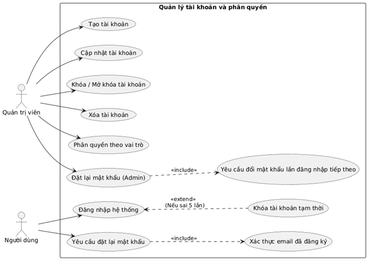
NHÓM 2: Quản lý hồ sơ học sinh
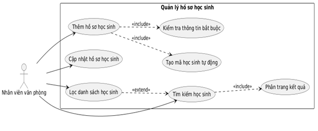
NHÓM 3: Quản lý lớp học
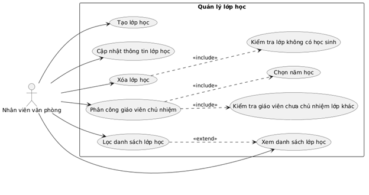
NHÓM 4: Quản lý điểm số và học lực
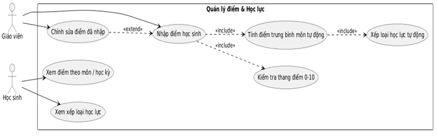
NHÓM 5: QUẢN LÝ HẠNH KIỂM
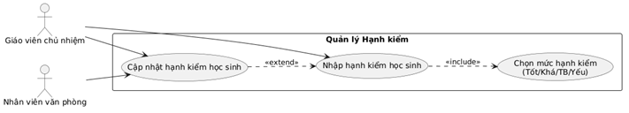
NHÓM 6: Quản lý năm học
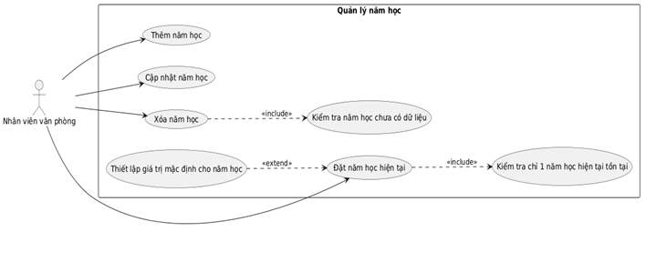
NHÓM 7: TRA CỨU THÔNG TiN
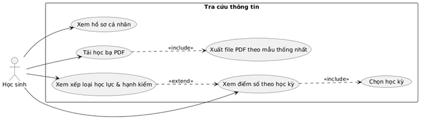
NHÓM 8: QUẢN LÝ THỜI KHOÁ BIỂU

NHÓM 9: QUẢN LÝ MÔN HỌC
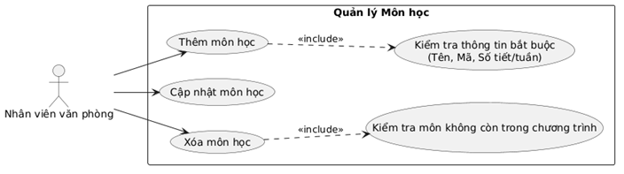
NHÓM 10: PHÂN CÔNG GIẢNG DẠY
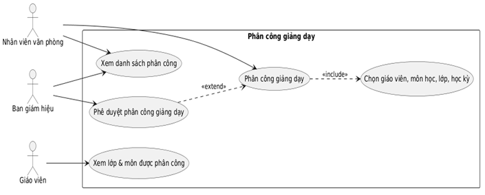
NHÓM 11: BÁO CÁO & THỐNG KÊ
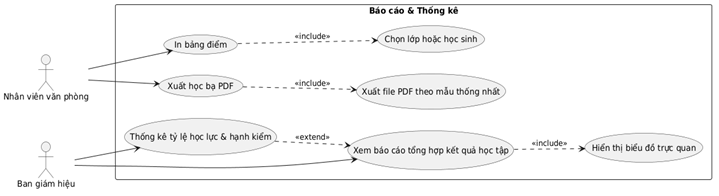
NHÓM 12: HỆ THỐNG & BẢO TRÌ
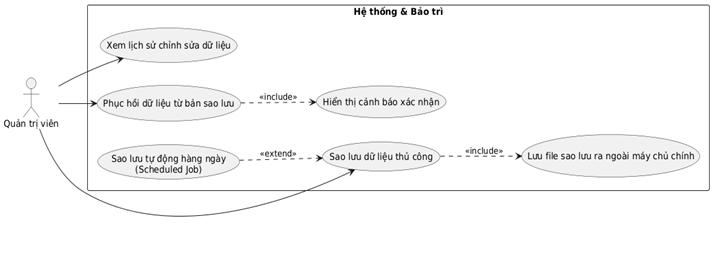

